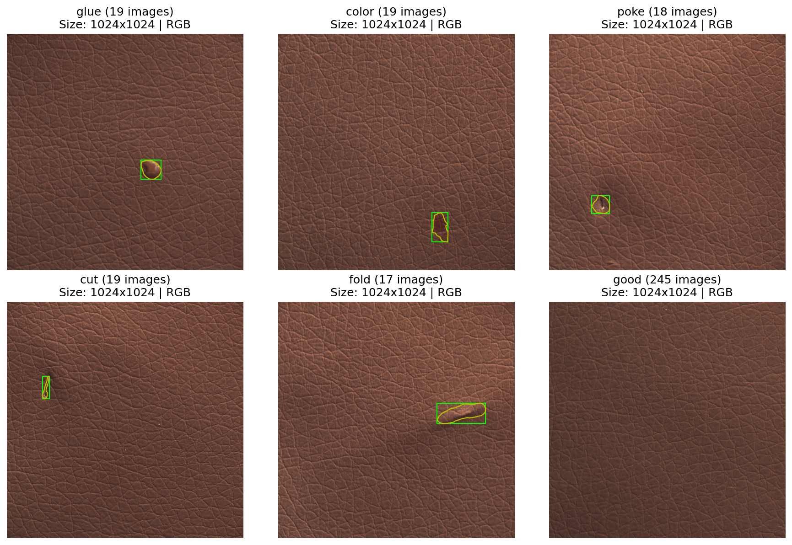
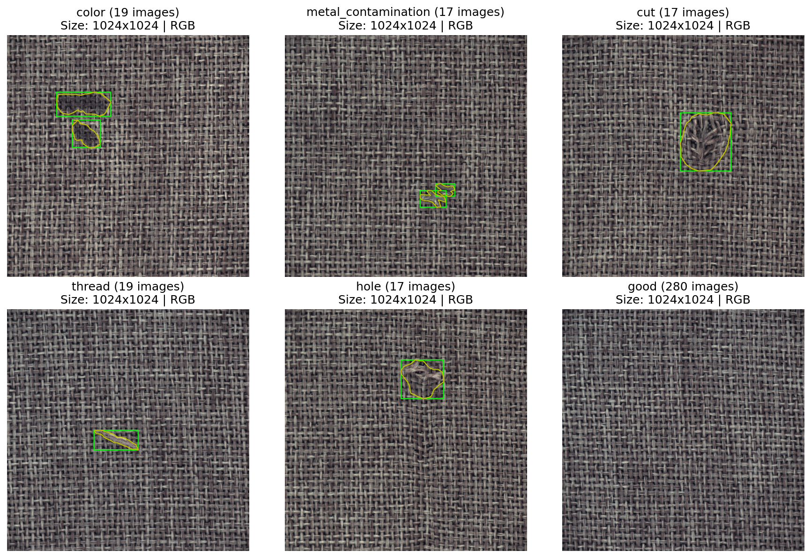
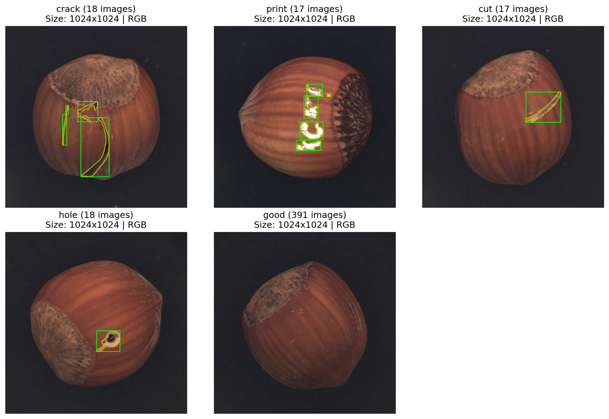
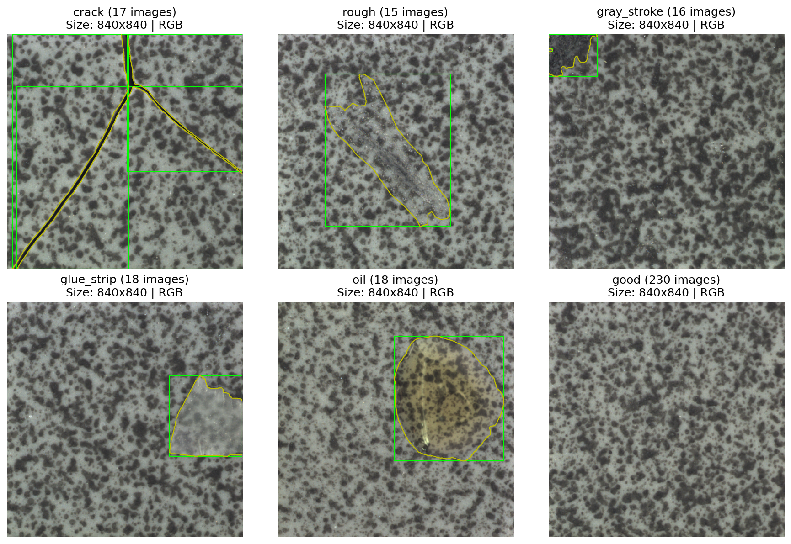
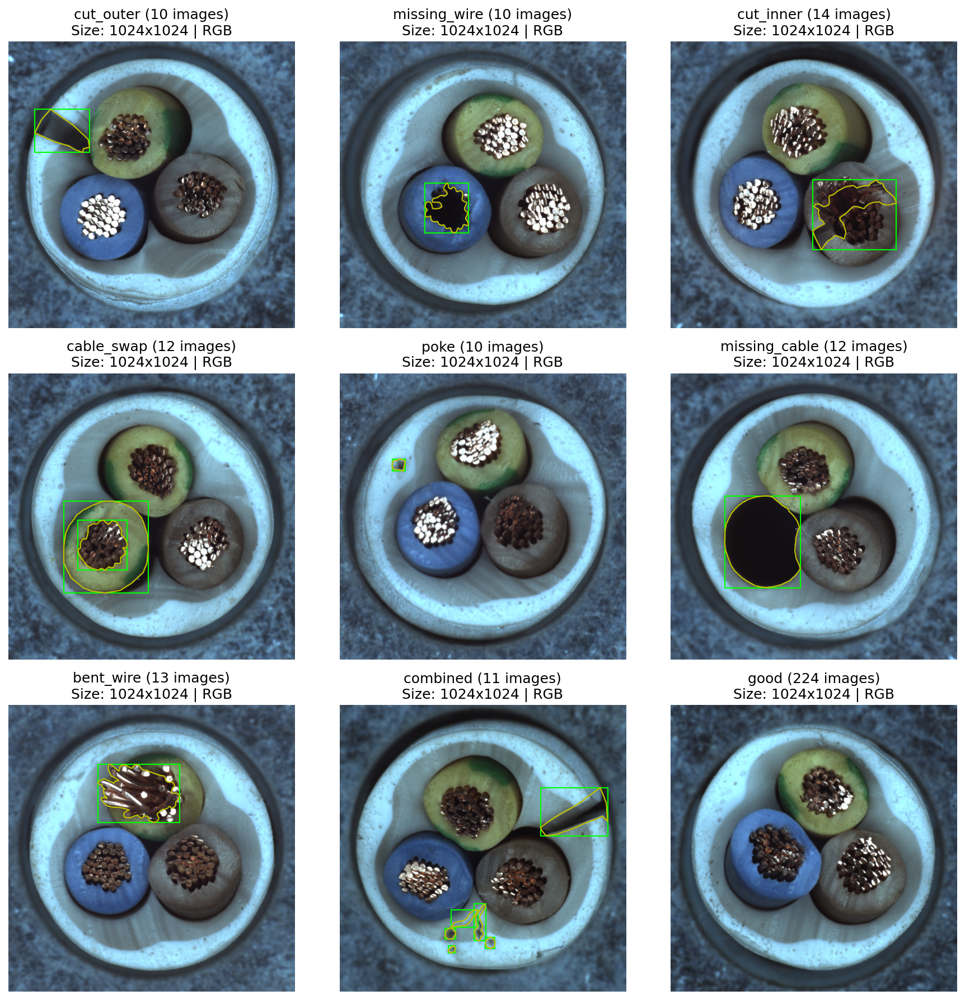
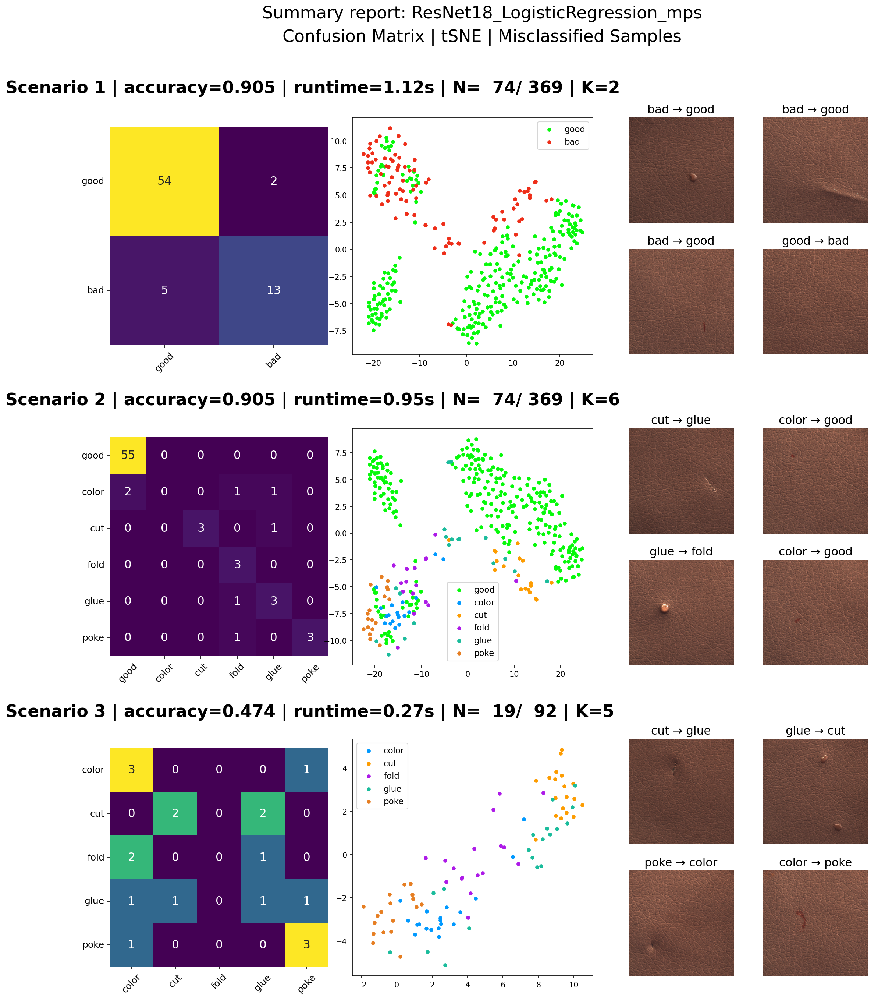

# Defect Defection

This notebook investigates around the defect detection methods in a supervised manner. We will use a datasets with annotated images (5 datasets of MVTec Anomaly Detection provided by Kaggle).

We will address the problem with three approaches
1) Image classification using the label of the defect, without using the mask images
2) Object detection, using the bounding boxes around the mask as ground-truth
3) Semantic segmentation, using the image mask without using the label of defects

#### Dataset
- Source: MVTec Anomaly Detection (Kaggle)
- 5 different components: tile, carpet, cable, leather, hazelnut
- Each dataset have different type of defect
- The good images have much more samples than the defects

<div class="card" style="width: 12
00px;">
<a href="scans/leather-summary_visualization.png" target="_blank">
  
</a>
<a href="scans/carpet-summary_visualization.png" target="_blank">
  
</a>
<a href="scans/hazelnut-summary_visualization.png" target="_blank">
  
</a>

<a href="scans/tile-summary_visualization.png" target="_blank">
  
</a>
<a href="scans/cable-summary_visualization.png" target="_blank">
  
</a>
</div><br>


```
datasets/
|-- component-defect-classes/
|  |-- bad/
|  | |-- defect1/
|  | | |-- 000.png, 001.png, ...
|  | |-- defect2/
|  |-- good/
|  | |-- 000.png, 001.png, ...
|  |-- bad-masks/
|  | |-- 000.png, 001.png, ...

```

### 1. Defect Classification

Supervised image classification methods for defect detection in industrial components.

#### Objectives
- Evaluate multiple feature extraction methods:
  - Classical algorithms: Discrete Cosine Transform (DCT), Histogram of Oriented Gradients (HOG), Color Moments (CM)
  - Pre-trained deep-learning models: DINOv2, DINOv3, ResNet18, ResNet50, VGG16, VGG19
- Compare classification methods: Logistic Regression, Random Forest, Support Vector Machine (SVC), K-Means
- Evaluate the effect of data augmentation
- Evaluate the patch-based approach


#### Experimental Scenarios of Classification

- **Scenario 1 — Binary classification** — Classes: *good* vs *bad*

- **Scenario 2 — Multi-class with normal class** — Classes: *good* + individual defect types

- **Scenario 3 — Defect-only classification** — Classes: defect types only (excluding *good*, less images)

#### Methodology

- Images are processed per component category independently
- Feature extraction is applied to all samples according the scenario
- A train/test split is defined per scenario
- A classifier is trained on extracted features
- Evaluation is performed using: Accuracy, Computation time, Confusion Matrix, tSNE


<p align="center"></p>

### 2. Defect Detection

- Train YOLO, 


### 3. Semantic Segmentation

- Train UNET, binary classification
